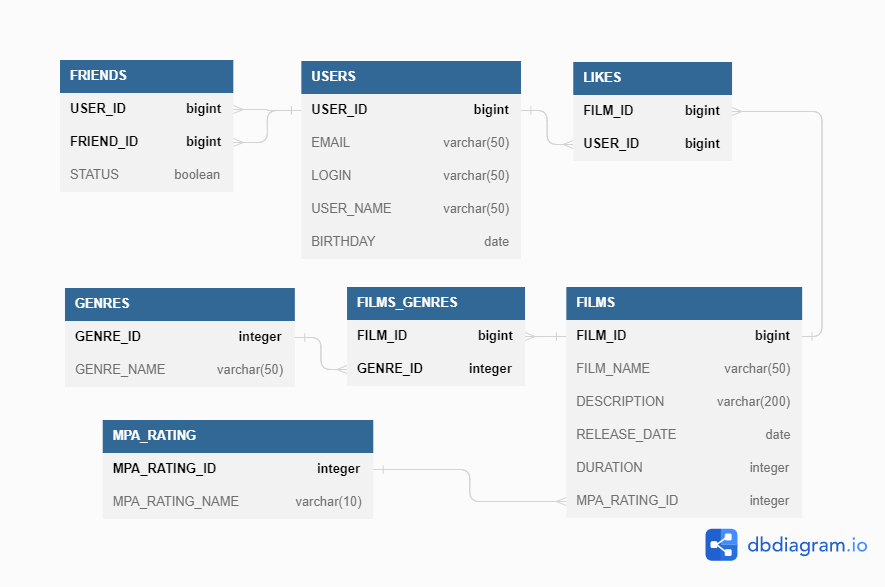

# Java-Filmorate

Java-Filmorate - это сервис для работы с фильмами и оценками пользователей, 
который поможет выбрать фильм для просмотра

## Функционал приложения:
1. Создавать, обновлять и получать фильмы;
2. Получать список всех фильмов;
3. Ставить лайки фильмам;
4. Получать топ популярных фильмов;
5. Создавать, обновлять и получать пользователей;
6. Показывать историю просмотренных задач.
7. Получать список всех пользователей.
8. Добавлять пользователей в друзья.
9. Получать список общих пользователей.

## Диаграмма DB:


### Описание диаграммы:
**user** - содержит данные о пользователях\
Таблица включает такие поля:
* первичный ключ `user_id` - идентификатор пользователя
* `email` - почта пользователя
* `login` - логин пользователя
* `name` - имя пользователя
* `birthday` - день рождение пользователя

**friends** - содержит данные о друзьях пользователя\
Таблица включает такие поля:
* первичный ключ №1 и внешний ключ `user_id` - идентификатор пользователя
* первичный ключ №2 и внешний ключ `friend_id` - идентификатор друга пользователя
* `status` - статус дружбы
  - `false` - ожидает подтверждения
  - `true` - дружба подтверждена

**film** - содержит данные о фильмах\
Таблица включает такие поля:
* первичный ключ `film_id` - идентификатор фильма
* `name` - название фильма
* `description` - описание фильма
* `release` - дата выхода фильма
* `duration` - продолжительность (в минутах) фильма
* внешний ключ `rating` - идентификатор возрастного рейтинга

**rating** - содержит типы возрастных рейтингов Ассоциации кинокомпаний
Таблица включает такие поля:
* первичный ключ `rating_id` - идентификатор возрастного рейтинга
* `name` - название возрастного рейтинга:
  - `G`
  - `PG`
  - `PG13`
  - `R`
  - `NC17`

**genre** - содержит типы жанров
Таблица включает такие поля:
* первичный ключ `genre_id` - идентификатор жанра
* `name` - название жанра

**film_genre** - содержит данные жанрах фильмов
Таблица включает такие поля:
* первичный ключ №1 и внешний ключ `film_id` - идентификатор фильма
* первичный ключ №2 и внешний ключ `genre_id` - идентификатор жанра

**likes** - содержит данные поставленных лайках фильмам
Таблица включает такие поля:
* первичный ключ №1 и внешний ключ `film_id` - идентификатор фильма
* первичный ключ №2 и внешний ключ `user_id` - идентификатор пользователя

### Примеры основных запросов:
* Получение всех пользователей:
```
SELECT *
FROM user;
```
* Получение пользователя с id = 1:
```
SELECT *
FROM user
WHERE user_id = 1;
```
* Получение друзей пользователя с id = 1:
```
SELECT f.friend_id,
       f.status,
       u.email,
       u.login,
       u.name,
       u.birthday
FROM friends AS f
LEFT OUTER JOIN user AS u ON f.friend_id = u.user_id
WHERE f.user_id = 1 AND f.status = 'true';
```
* Получение общих друзей пользователей с id = 1 и id = 2:
```
SELECT DISTINCT f.friend_id,
       f.status,
       u.email,
       u.login,
       u.name,
       u.birthday
FROM friends AS f
LEFT OUTER JOIN user AS u ON f.friend_id = u.user_id
WHERE f.user_id = 1 
      AND f.status = 'true' 
      AND f.friend_id IN (
          SELECT friend_id
          FROM friends
          WHERE user_id = 2
      );
```
* Получение всех фильмов:
```
SELECT *
FROM film;
```
* Получение фильма с id = 1:
```
SELECT *
FROM film
WHERE film_id = 1;
```
* Получение топ 10 популярных фильмов:
```
SELECT l.film_id,
       f.name,
       f.description,
       f.release,
       f.duration,
       r.name AS film_rating
FROM likes AS l
LEFT OUTER JOIN film AS f ON l.film_id = f.film_id
LEFT OUTER JOIN rating AS r ON f.rating = r.rating_id
GROUP BY l.film_id
ORDER BY COUNT(l.user_id) DESC
LIMIT 10;
```